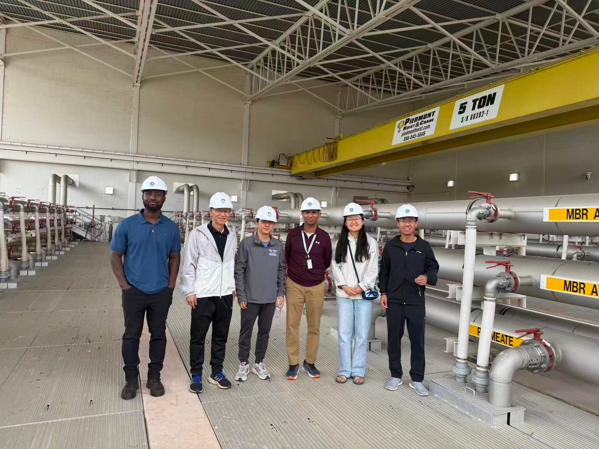

Visited the Gwinnett County wastewater facility with collaborators to learn how wastewater is treated through biological processes and membrane systems.

This visit marks the start of a new project with Civil and Environmental Engineering at Georgia Tech, where we aim to explore the use of reinforcement learning for improving decision-making in complex environmental systems.

Learned a lot from the field trip and excited about the potential of RL in wastewater treatment!

